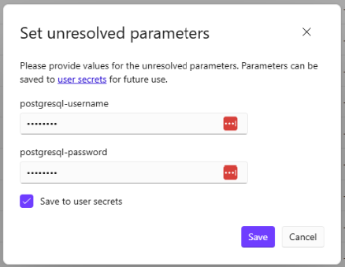

Full Aspire Sample
==================

This sample demonstrates a broad set of .NET Aspire features and patterns:

- Orchestrating containers and dependent services
- Running a .NET API
- Running Azure Functions (isolated worker)
- Running Node.js browser apps (React, Vue)
- Proxying everything behind a YARP reverse proxy

There is no tutorial here.  It's only an example.


Projects and their Purpose
--------------------------

This solution demonstrates several different approaches for building cloud apps. In real-world production, you would typically pick one approach for simplicity, but here you can explore multiple patterns for learning and comparison.

See the full architecture diagrams in this folder:

- [Production view with YARP reverse proxy](./architecture-rp.md)
- [Development view with Vite as the reverse proxy](./architecture-dev.md)

### Aspire projects

- **AspireEverything.AppHost**
  Orchestrates all services and resources for local development. Starts containers, sets up environment variables, and launches all other projects.

- **AspireEverything.ServiceDefaults**
  Common setup of .NET best practices including OpenTelemetry logs, traces, and metrics; HttpClient retries; and health monitoring.

### Data stores

- **PostgreSQL**
  A great open-source database.  It contains 2 tables:

  - frameworks: the rows in the UI list
  - votes: the number of votes for each row

- **Redis**
  A great key/value store useful for caching.

- **postgres-init**
  The Postgres database initialization script.

### Backends

This shows 2 options: running in containers, and running in a series of functions.  In a production solution, you'd choose one or the other.

- **AspireEverything.FrameworkApi**
  This is an example of running a rich API in a container.  This API has CRUD methods for the framework table.

- **AspireEverything.VoteGet**
  This is an example of building an API surface as a series of functions.  The VoteGet function queries data from the votes table.

- **AspireEverything.VoteScore**
  Azure Function (C#) for scoring votes. Processes and updates the votes table.

- **AspireEverything.VoteData**
  The common libraries across the Azure functions for accessing the votes table.

### Frontends

This solution shows 3 options: React, Vue.js, and a Blazor standalone app.  In a production solution, you'd likely choose one frontend technology.  In this example, each of the frontends is visually and functionally identical.

- **AspireEverything.WebBlazor**
  Standalone Blazor WebAssembly frontend. Provides a .NET-based browser UI for interacting with the backend.  Sadly, this app can't reference ServiceDefaults because it is built into static HTML, JS, and CSS files.  Therefore there's no OpenTelemetry in this app.

- **AspireEverything.WebReact**
  The UI built with React, TypeScript, and Vite.

- **AspireEverything.WebVue**
  The UI built with Vue.js, TypeScript, and Vite.

### Reverse Proxy

A reverse proxy nicely proxies traffic to different services depending on the URL.  This avoids complicated CORS setup and cross-domain requests.

In this solution, we expose all the other services to show the CORS options too, though generally a reverse-proxy is a better solution.

All the reverse proxies follow these rules:

- `/*` to the frontend of your choice
- `/api/framework*` to the framework api project
- `/api/vote/get` to the VoteGet Azure Function
- `/api/vote/score` to the VoteScore Azure Function

Here's the reverse proxies in use in this example:

- [**YARP**](./AspireEverything.AppHost/AppHost.cs#L108-L118)
  Yet Another Reverse Proxy is a .NET, config-based reverse proxy. See the routes configured near the bottom of `AppHost.cs`. YARP runs as a separate container.

- [**Vite**](./AspireEverything.WebReact/vite.config.ts)
  For both Node.js frontend apps during development time, Vite accepts Aspire's service discovery environment variables, and sets up the reverse proxy rules.

  Towards production, Vite build will render the assets into static files, and the Dockerfile injects these files into an Nginx container.  Therefore in production there is no Vite reverse proxy.

- [**Kubernetes Ingress**](./k8s/templates/ingress.yaml)
  In the k8s folder, we use a Kubernetes Ingress as a reverse proxy.  If you choose to deploy to Kubernetes, this is likely the simplest mechanism to install a reverse proxy.

- [**Blazor's proxy.config.json**](./AspireEverything.WebBlazor/proxy.config.json)
  Blazor has a mechanism for setting up the dev-time reverse proxy for Blazor standalone apps.  Sadly, Aspire doesn't launch Blazor with `dotnet run`, so Blazor's reverse proxy doesn't work.


### Deployment

This solution includes examples of many (conflicting) deployment strategies.  In a typical solution you would only have a single deployment strategy.  The examples here are for demonstration only.  In a production application, you would choose the one you like best, and delete the others.

- **Docker Compose**
  Docker Compose is a great development tool for propping up dependent resources that are not the focus of your current task.  The Aspire CLI can scaffold a docker-compose.yaml file from an AppHost.

- **Kubernetes**
  Kubernetes is a enterprise-grade production deployment system.  The Aspire CLI can scaffold Kubernetes YAML files that can deploy containerized resources.

- **Azure Container Apps (ACA)**
  Azure Container Apps is the launch example of the Aspire deployment system.  ACA is an abstraction over top of Kubernetes that drastically simplifies the YAML.  When the Aspire CLI publishes to ACA, it creates Bicep files that uses Azure resources and cloud best practices.

- **Manual docker-compose.yaml file**
  We've committed an example [`docker-compose.yaml`] file tuned to local development.  It uses Azurite, an Azure Storage emulator in a container to make the entire process self-contained.  This could be great if you want to try out a portion of the solution without wanting to install dependencies.

- **Manual k8s yaml files**
  We've committed the `k8s` folder of Kubernetes YAML files.  Unlike the Aspire CLI, we don't depend on any Bicep here.  It also means we need to push everything into a container.  This solution uses Azurite, an Azure Storage emulator, and Postgres and Redis containers.  If you're looking to deploy Kubernetes to production, you should use PaaS solutions: Azure Storage, Postgres for Azure, and Azure Redis Cache.

- **Don't deploy through Aspire**
  Perhaps your solution has already solved deployment another way or your organization requires deployment using very specific patterns and tools.  In that case, don't use Aspire for deployment, and only use it for development time.  This is a great use of Aspire.


Getting Started with Development
--------------------------------

Here's the steps for running the sample locally:

1. Ensure you have all the prerequisites installed from the [0-install chapter](../0-install/README.md).

2. In the folder with this README, open a terminal and run:

   ```PowerShell
   init.ps1
   ```

   OR

   ```sh
   init.sh
   ```

   This will `npm install` into each of the Node.js projects and copy the functions' `local.settings.json` into place.

3. Open `AspireEverything.slnx` in Visual Studio or VS Code.

   If this is the first time you've launched a `.slnx` file, it may ask you what application you'd like to use to launch it.  Choose your favorite IDE, and click `Always`.

4. Set `AspireEverything.AppHost` as the startup project if it isn't already.

5. In `AspireEverything.AppHost/AppHost.cs` choose which frontend you'd like to run:

   ```csharp
           yarp.AddRoute(frontendReact); // or frontendReact or frontendVue or frontendBlazor
   ```

6. Start debugging the AppHost project in Visual Studio or VS Code.

   Alternatively, from a terminal in the same directory as the slnx file, run `aspire run`.

7. Set the database parameters.

   a. At the top of the dashboard, it notes we haven't yet set the database username and password.

      

   b. On the top-right, click the `Enter Parameters` button to open the dialog.

   c. Set a convenient username and password for the Postgres database.

      

   d. These will get saved into User Secrets.

8. In the Aspire dashboard, open the `gateway` or `frontendReact` or `frontendVue` project.

9. Add some sample data, and then vote them up.


Deploying the Sample
--------------------

This solution includes many deployment strategies.  In your application, you'll likely lean into a single deployment strategy, drastically simplifying the code.  For demonstration purposes, we've included many (contradictory) examples to give you options.  Definitely don't use this approach in your production apps.  Instead, choose the deployment strategy that works best for you, and do only that one.  And if you've already solved deployment concerns in another way, you need not use Aspire for deployment; instead only use Aspire for development concerns.

This solution can deploy via Aspire to Docker Compose, Kubernetes, or Azure Container Apps.  There is no flag in the Aspire CLI to select the deployment target at publish-time; instead this sample uses a hard-coded variable at the top of `AspireEverything.AppHost/AppHost.cs` to control the deploy target.

- **Docker Compose**  Docker Compose is a great way in development to start other dependencies so you can focus on a specific target.  Perhaps you want to develop the React app but don't have .NET installed on your machine.  To use the Aspire CLI to deploy to Docker Compose:

  1. In `AspireEverything/AppHost.cs` change the line to `string deployTo = "docker-compose";` and save the file.

  2. Run this command from the same directory as the slnx file:

     ```sh
     aspire publish -o dist
     ```

  3. Open the `dist` directory to browse the files.

     Note that there's some Bicep files for Azure resources that generally don't run out of containers.  For example, the docker-compose.yaml file references Azure Storage for dependencies of the Azure Functions.

  4. You could run this locally from the terminal started above:

     ```sh
     cd dist
     az group create -n AspireDockerGroup --location "Central US"
     az deployment group create -n AspireDocker -g AspireDockerGroup --template-file main.bicep --parameters ...
     docker compose up
     ```

- **Kubernetes**  Kubernetes is an enterprise solution for running containerized workloads.  You could use this solution to deploy all the apps into a Kubernetes cluster.

  1. In `AspireEverything/AppHost.cs` change the line to `string deployTo = "kubernetes";` and save the file.

  2. Run this command from the same directory as the slnx file:

     ```sh
     aspire publish -o dist
     ```

  3. Open the `dist` directory to browse the files.

     This created a helm chart.  Very cool.  We'll need the [helm](https://helm.sh/docs/intro/install/) CLI to run the chart.

     Like any Helm chart, `values.yaml` includes all the parameters for running the helm chart.

     You can see the Kubernetes YAML files inside the `templates` directory.  Note that there's one folder for each resource, and one or more files for all the pieces necessary.  For example, for `frameworkapi`, there's a deployment, a service, and a ConfigMap for OpenTelemetry configuration and a secret for connection strings.

  4. You could deploy this into Azure Kubernetes Service from the terminal started above:

     ```sh
     cd dist
     az group create -n AspireK8sGroup --location "Central US"
     az deployment group create -n AspireK8s -g AspireK8sGroup --template-file main.bicep --parameters ...
     helm template . | kubectl apply -f -
     ```

- **Azure Container Apps (ACA)**  ACA is a great way to run containers when the complexity of Kubernetes YAML is too much.  ACA is an abstraction built on top of Kubernetes.  You could use this solution to deploy all the apps into Azure Container Apps.

  1. In `AspireEverything/AppHost.cs` change the line to `string deployTo = "azure-container-apps";` and save the file.

  2. Run this command from the same directory as the slnx file:

     ```sh
     aspire publish -o dist
     ```

  3. Open the `dist` directory to browse the files.

     In this directory are a lot of bicep files that'll configure everything to run in Azure using Azure best practices.

  4. You could deploy this into Azure from the terminal started above:

     ```sh
     cd dist
     az group create -n AspireAcaGroup --location "Central US"
     az deployment group create -n AspireAca -g AspireAcaGroup --template-file main.bicep --parameters ...
     ```

- **Manual to Docker Compose**  The docker-compose.yaml file created by the Aspire CLI might be a bit much.  Maybe you want to start with that, but then tweak it to meet your needs.  We've done that here, committing a `docker-compose.yaml` file right next to the slnx file.  Unlike the Aspire CLI's docker-compose file, this uses containers for everything making it self-contained.  Instead of Azure Storage, we use Azurite, an Azure Storage emulator in a container.

  1. Open a terminal in the same directory as the slnx file.

  2. Build all the containers:

     ```sh
     build-manual.sh # or ./build-manual.ps1
     ```

  3. Choose which frontend you'd like to run.  Open `docker-compose.yaml` in a text editor and change the `image` line from `aspire-react` to any container you'd like to run:

     ```yaml
       frontend:
         image: ${ACR_URL}/aspire-react:${IMAGE_LABEL} # or aspire-react or aspire-blazor
     ```

     `build-manual.sh` above built all 3, so you can pick any of the container images you like.

  4. Optional: Adjust the `.env` file next to `docker-compose.yaml` with credentials for the Postgres database and other configuration:

     ```dotenv
     POSTGRESQL_USERNAME=postgres
     POSTGRESQL_PASSWORD=Aspire123!
     REDIS_PASSWORD=Aspire123!
     ACR_URL=robrich.azurecr.io
     IMAGE_LABEL=latest
     ```

  5. Run the Docker Compose file:

     ```sh
     docker compose up
     ```

  6. You'll see that it launches all the containers and even the Aspire dashboard.

  7. Open a browser to the following URLs to experience the project:

     - http://localhost:8080/  This is the gateway, the reverse-proxy in front of the entire solution, ensuring you don't need complex CORS setup to use all the projects together.
     - http://localhost:8000/  This is the Aspire dashboard.  Note that the resources list is missing because Visual Studio isn't feeding the list to the container.

  8. When you're done, shut down the solution in Docker:

     ```sh
     docker compose down
     ```

  You may choose to alter this docker-compose file to add PgWeb and/or RedisCommander containers to administer the data stores.

- **Manual to Kubernetes**  The helm chart created by the Aspire CLI might be a bit much.  Maybe you want to start with the scaffolding it created, but then tweak it to fit your needs.  We've done that here, committing the `k8s` folder with a Helm chart within it.  Unlike the Aspire CLI's helm chart, this is completely self-contained.

  In a production environment, you'll want to use PaaS data stores including Azure Storage, Postgres for Azure, and Azure Redis Cache.

  In this sample, we use their containers to ensure the solution will run great on Podman or Docker Desktop.

  To run this sample in your local Kubernetes cluster:

  1. Open a terminal in the same directory as the slnx file.

  2. Install Nginx's ingress controller:

     ```sh
     ./k8s/nginx-ingress-install.sh # or .ps1
     ```

  3. Build all the containers:

     ```sh
     build-manual.sh # or ./build-manual.ps1
     ```

  4. Choose which frontend you'd like to run.

     Open `k8s/templates/frontend.yaml` and change `aspire-react` to whichever container you'd like to run:

     ```yaml
     image: {{ .Values.acrUrl }}/aspire-react:{{ .Values.imageVersion }} # or aspire-vue or aspire-react or aspire-blazor
     ```

     `build-manual.sh` above built all 3, so you can pick whichever container image you'd prefer.

  4. Run the helm chart:

     ```sh
     helm template k8s | kubectl apply -f -
     ```

  5. You'll see that it launches all the containers but does not run the Aspire dashboard.

  6. Open a browser to the following URLs to experience the project:

     http://localhost:80/

     This is the gateway, the reverse-proxy in front of the entire solution, ensuring you don't need complex CORS setup to use all the projects together.

  7. When you're done, shut down the Kubernetes solution:

     ```sh
     helm template k8s | kubectl delete -f -
     ```

  In this helm chart, you can see the following adjustments from the Aspire CLI version:

  - `secrets.yaml` includes the connection strings used by the frameworkapi container and both functions.
  - `func-common-configmap.yaml` includes all the config common between the two Azure function containers.
  - `azurite.yaml` replaces Azure Storage with a containerized emulator, allowing this sample to be self-contained.

- **Don't deploy through Aspire**  Perhaps your solution has already solved deployment another way or your organization requires deployment using very specific patterns and tools.  In that case, don't use Aspire for deployment, and only use it for development time.  This is a great use of Aspire.

Of course your production solution would only use one deployment strategy.  This sample includes one of each so you can compare and contrast.  Were you to deploy this solution, you'd likely choose your favorite strategy, and delete the rest.


Troubleshooting
---------------

- PowerShell script execution policy prevents running `init.ps1`:
  - Run the script for this session only: `Set-ExecutionPolicy -Scope Process -ExecutionPolicy Bypass`
  - Then run: `./init.ps1`

- Aspire CLI not found:
  - Ensure it's installed and on PATH. See [Chapter 0's install instructions](../0-install/README.md) step 4.

- Azure Functions fail to start locally:
  - Install/upgrade Azure Functions Core Tools v4. See [Chapter 0's install instructions](../0-install/README.md) step 5.

- Frontend 404s or CORS errors during dev:
  - Prefer accessing via the `gateway` reverse proxy from the Aspire dashboard.
  - For direct dev servers (Vite), the proxy targets are derived from Aspire-injected env vars. Check `vite.config.ts` in each frontend.

- Database credentials missing:
  - Use the Aspire dashboard’s "Enter Parameters" to set Postgres username/password. They’re stored in User Secrets under the id `AspireEverything`.

- Running tests:
  - From this folder: `dotnet test`
  - The `build-manual.ps1` script also runs unit tests in containers as part of the build.
