Full Aspire Sample
==================

This sample shows a lot of features of Aspire including:

- orchestrating containers
- running a .NET API
- running Azure Functions
- running Node.js browser apps
- proxying everything behind YARP


Architecture
------------

Here's the project pieces:

```mermaid
flowchart TD
  subgraph Database
    direction TB
    Postgres[(🐘 Postgres DB)]
    PgWeb[🖥️ PgWeb]
    PostgresInit[📄 Postgres Init SQL]
    subgraph Tables
      direction TB
      TableFrameworks[[🧱 public.frameworks table]]
      TableVotes[[🧱 public.votes table]]
    end
  end

  subgraph Cache
    direction TB
    Redis[(🧠 Redis)]
    RedisCommander[🖥️ Redis Commander]
  end

  subgraph Backend
    FrameworkApi[⚙️ FrameworkApi - .NET API]
    VoteGet[⚡ VoteGet - C# Azure Function]
    VoteScore[⚡ VoteScore - C# Azure Function]
  end

  subgraph Frontend
    FrontendApp[💻 Frontend - Vue.js app]
  end

  Gateway[🔀 Gateway - YARP]

  %% Database setup
  PostgresInit --> Postgres
  PgWeb --> Postgres
  Postgres --> TableFrameworks
  Postgres --> TableVotes

  %% Cache setup
  RedisCommander --> Redis

  %% Backend references
  FrameworkApi --> Postgres
  FrameworkApi --> Redis

  VoteGet --> Postgres
  VoteGet --> Redis

  VoteScore --> Postgres

  %% Frontend references
  FrontendApp --> FrameworkApi
  FrontendApp --> VoteGet
  FrontendApp --> VoteScore

  %% Gateway routes
  Gateway -- "/api/vote/get" --> VoteGet
  Gateway -- "/api/vote/score" --> VoteScore
  Gateway -- "/api/framework" --> FrameworkApi
  Gateway -- "/" --> FrontendApp

  %% External access
  User((👤 User)) -- "HTTP" --> Gateway
```




Projects and their Purpose
--------------------------

This solution demonstrates several different approaches for building cloud apps. In real-world production, you would typically pick one approach for simplicity, but here you can explore multiple patterns for learning and comparison.

- **AspireEverything.AppHost**
  Orchestrates all services and resources for local development. Starts containers, sets up environment variables, and launches all other projects.

- **AspireEverything.ServiceDefaults**
  Common setup of .NET best practices including OpenTelemetry logs, traces, and metrics; HttpClient retries; and health monitoring.

### Data stores

- **PostgreSQL**
  A great open-source database.  It contains 2 tables:

  - frameworks: the rows in the UI list
  - votes: the number of votes for each row

- **Redis**
  A great key/value store useful for caching.

- **postgres-init**
  The Postgres database initialization script.

### Backends

This shows 2 options: running in containers, and running in a series of functions.  In a production solution, you'd choose one or the other.

- **AspireEverything.FrameworkApi**
  This is an example of running a rich API in a container.  This API has CRUD methods for the framework table..

- **AspireEverything.VoteGet**
  This is an example of building an API surface as a series of functions.  The VoteGet function queries data from the votes table.

- **AspireEverything.VoteScore**
  Azure Function (C#) for scoring votes. Processes and updates the votes table.

- **AspireEverything.VoteData**
  The common libraries across the Azure functions for accessing the votes table.

### Frontends

This solution shows 3 options: React, Vue.js, and a Blazor standalone app.  In a production solution, you'd likely choose one technology and use it to build the full UI.  In this example, each of the frontends is visually and functionally identical.

- **AspireEverything.WebBlazor**
  Standalone Blazor WebAssembly frontend. Provides a .NET-based browser UI for interacting with the backend.  Sadly, this app can't reference ServiceDefaults because it is built into static HTML, JS, and CSS files.  Therefore there's no OpenTelemetry in this app.

- **AspireEverything.WebReact**
  The UI built with React, TypeScript, and Vite.

- **AspireEverything.WebVue**
  The UI built with Vue.js, TypeScript, and Vite.

### Reverse Proxy

A reverse proxy nicely proxies traffic to different services depending on the URL.  This avoids complicated CORS setup and cross-domain requests.

In this solution, we expose all the other services to show the CORS options too, though generally a reverse-proxy is a better solution.

All the revere proxies follow these rules:

- `/*` to the frontend of your choice
- `/api/framework*` to the framework api project
- `/api/vote/get` to the VoteGet Azure Function
- `/api/vote/score` to the VoteScore Azure Function

Here's the reverse proxies in use in this example:

!!! HACK: link to the files where it does this

- **YARP**
  Yet Another Reverse Proxy is a .NET, config-based reverse proxy that runs as a separate container.

- **Vite**
  For both Node.js frontend apps during development time, Vite accepts Aspire's service discovery environment variables, and sets up the reverse proxy rules.

  Towards production, Vite build will render the assets into static files, and the Dockerfile injects these files into an Nginx container.  Therefore in production there is no Vite reverse proxy.

- **Kubernetes Ingress**
  In the k8s folder, we use a Kubernetes Ingress as a reverse proxy.  If you choose to deploy to Kubernetes, this is likely the simplest mechanism to install a reverse proxy.

- **Blazor's proxy.config.json**
  Blazor has a mechanism for setting up the dev-time reverse proxy for Blazor standalone apps.  Sadly, Aspire doesn't launch Blazor with `dotnet run`, so Blazor's reverse proxy doesn't work.


### Deployment

This solution can deploy via Aspire to Docker Compose, Kubernetes, or Azure Container Apps.  There is no way in the Aspire CLI to specify the deployment target, so this solution uses a hard-coded variable at the top of AppHost/AppHost.cs to control where we'll deploy.

Getting Started
---------------

Here's the steps for running the sample locally:

1. Ensure you have all the prerequisites installed from the 0-install chapter.

2. In the folder with this README, open a terminal and run:

   ```PowerShell
   init.ps1
   ```

   OR

   ```sh
   init.sh
   ```

   This will `npm install` into each of the Node.js projects and copy the functions' `local.settings.json` into place.

3. Open `AspireEverything.slnx` in Visual Studio or VS Code.

4. Set the startup project to `AspireEverything.AppHost` if it isn't already.

5. Start debugging.

6. In the Aspire dashboard, open the `gateway` or `frontendReact` or `frontendVue` project.

7. Add some sample data, and then vote them up.


Deployment
----------


