Full Aspire Sample
==================

This sample shows a lot of features of Aspire including:

- connecting to a database container
- running a .NET API
- running Azure Functions
- running Node.js browser apps
- proxying everything behind YARP


Architecture
------------

Here's the project pieces:

```mermaid
flowchart TD
  subgraph Database
    direction TB
    Postgres[(🐘 Postgres DB)]
    PgWeb[🖥️ PgWeb]
    PostgresInit[📄 Postgres Init SQL]
    subgraph Tables
      direction TB
      TableFrameworks[[🧱 public.frameworks table]]
      TableVotes[[🧱 public.votes table]]
    end
  end

  subgraph Cache
    direction TB
    Redis[(🧠 Redis)]
    RedisCommander[🖥️ Redis Commander]
  end

  subgraph Backend
    FrameworkApi[⚙️ FrameworkApi - .NET API]
    VoteGet[⚡ VoteGet - C# Azure Function]
    VoteScore[⚡ VoteScore - C# Azure Function]
  end

  subgraph Frontend
    FrontendApp[💻 Frontend - Vue.js app]
  end

  Gateway[🔀 Gateway - YARP]

  %% Database setup
  PostgresInit --> Postgres
  PgWeb --> Postgres
  Postgres --> TableFrameworks
  Postgres --> TableVotes

  %% Cache setup
  RedisCommander --> Redis

  %% Backend references
  FrameworkApi --> Postgres
  FrameworkApi --> Redis

  VoteGet --> Postgres
  VoteGet --> Redis

  VoteScore --> Postgres

  %% Frontend references
  FrontendApp --> FrameworkApi
  FrontendApp --> VoteGet
  FrontendApp --> VoteScore

  %% Gateway routes
  Gateway -- "/api/vote/get" --> VoteGet
  Gateway -- "/api/vote/score" --> VoteScore
  Gateway -- "/api/framework" --> FrameworkApi
  Gateway -- "/" --> FrontendApp

  %% External access
  User((👤 User)) -- "HTTP" --> Gateway
```



Getting Started
---------------

1. Ensure you have Docker Desktop or Podman installed and running.

2. In the `AspireEverything.WebReact` folder, open a terminal and run

   ```sh
   npm install
   ```

3. In the `AspireEverything.WebVue` folder, open a terminal and run

   ```sh
   npm install
   ```

4. Open `AspireEverything.slnx` in Visual Studio or VS Code.

5. Set the startup project to `AspireEverything.AppHost` if it isn't already.

6. Start debugging.

7. In the Aspire dashboard, open the `frontendReact` or `frontendVue` project.

8. Add some frameworks, and then vote them up.
