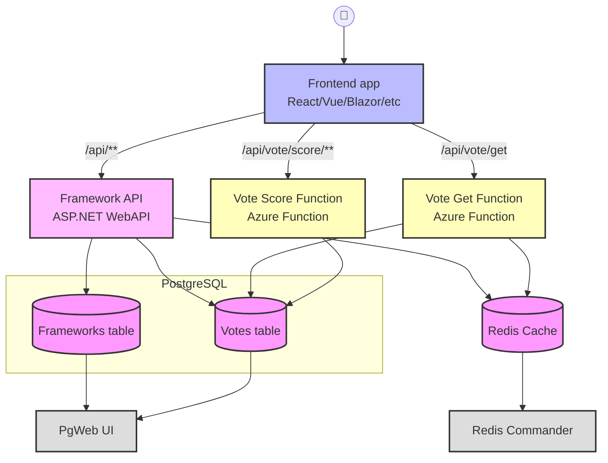

Architecture Diagram during Development
=======================================

In this version, we use Vite baked into the fronend as a development-time reverse-proxy.

```mermaid
graph TB
    %% Services
    frontend[Frontend app<br/>React/Vue/Blazor/etc]
    frameworkApi[Framework API<br/>ASP.NET WebAPI]
    funcVoteGet[Vote Get Function<br/>Azure Function]
    funcVoteScore[Vote Score Function<br/>Azure Function]
    redis[(Redis Cache)]
    pgweb[PgWeb UI]
    redisCommander[Redis Commander]

    %% PostgreSQL grouped tables
    subgraph postgresDB[PostgreSQL]
        direction TB
        frameworksTable[(Frameworks table)]
        votesTable[(Votes table)]
    end

    %% Database connections
    frameworksTable --> pgweb
    votesTable --> pgweb
    redis --> redisCommander

    %% Service dependencies
    frontend --> |/api/vote/get| funcVoteGet
    frontend --> |/api/vote/score/**| funcVoteScore
    frontend --> |/api/**| frameworkApi

    frameworkApi --> frameworksTable
    frameworkApi --> votesTable
    frameworkApi --> redis

    funcVoteGet --> votesTable
    funcVoteGet --> redis

    funcVoteScore --> votesTable

    user((👤)) --> frontend

    %% Styling
    classDef database fill:#f9f,stroke:#333,stroke-width:2px
    classDef frontend fill:#bbf,stroke:#333,stroke-width:2px
    classDef function fill:#ffb,stroke:#333,stroke-width:2px
    classDef api fill:#fbf,stroke:#333,stroke-width:2px
    classDef ui fill:#ddd,stroke:#333,stroke-width:2px

    class frameworksTable,votesTable,redis database
    class frontend frontend
    class funcVoteGet,funcVoteScore function
    class frameworkApi api
    class pgweb,redisCommander ui
```
