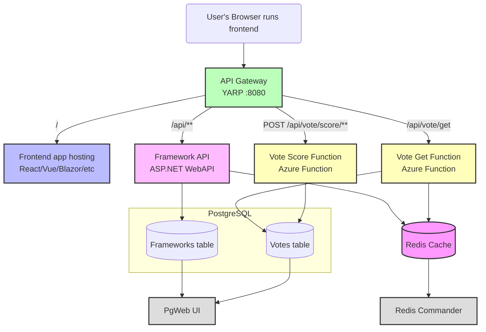

Architecture Diagram for Production
===================================

In production, you'll include a reverse-proxy to eliminate CORS configuration and run all the containers from the same sub-domain.

