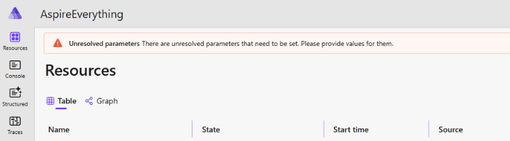

Aspire - Beyond the Basics
==========================

This tutorial gets beyond the Hello-World of Aspire and shows how to add Aspire components, other projects, and data stores to an Aspire application.

We'll start with where we left off in Chapter 2-greenfield and build up towards Chapter 1-everything.

If you'd rather, start with your own project, and after adding Aspire to it using the steps from Chapter 3-brownfield, continue here adding other components and integrations.

You can also look through the components on the [Aspire Documentation](https://learn.microsoft.com/en-us/dotnet/aspire/fundamentals/integrations-overview) and add any additional integrations that make you happy.


Prerequisites
-------------

1. Ensure you've installed everything from [Chapter 0](../0-install/README.md)

2. Ensure your container runtime is started.

   Start Docker Desktop or Podman.

3. Select a project to augment. You could choose:

   - The greenfield application from Chapter 2

   - The brownfield application from Chapter 3

   - A brand new project you create with File -> New Project

   - A solution you've created elsewhere


Overview
--------

In this chapter, we'll progressively add advanced Aspire features:

0. **Verify the solution** starts correctly
1. **Add PostgreSQL database** with initialization scripts and data persistence
2. **Configure parameters** for secure credential management
3. **Add PgWeb** for database administration
4. **Add an Azure Function** to the orchestration
5. **Add a Node.js frontend project** (React, Vue.js, or other frontend)
6. **Configure reverse proxy** using either Vite (option 1) or YARP (option 2) to unify all services
7. **Explore other integrations** from the Aspire ecosystem

By the end, you'll have a comprehensive understanding of Aspire's capabilities and be ready to apply them to your own projects.


Step 0: Verify the solution
---------------------------

Let's ensure Aspire starts correctly and all the projects in your solution start.

1. In your IDE of choice (Visual Studio, VS Code, Ryder, etc), open the solution you've chosen.

2. Set the AppHost project as the startup project.

3. Start debugging.

4. When the Aspire dashboard loads in your browser, ensure all the resources start correctly - show green.

5. If the app does not start correctly, in the Aspire dashboard, switch to the Console tab, change the Resource (top-left) to the erroring resource, and debug the app.  Then make necessary changes.

6. Stop debugging.


Step 1: Add Postgres Database
-----------------------------

PostgreSQL is a great open-source relational database. Let's add it to our Aspire application.  See also https://learn.microsoft.com/en-us/dotnet/aspire/database/postgresql-integration

Optionally: you could replace this with SQL Server with minor variations.  See https://learn.microsoft.com/en-us/dotnet/aspire/database/sql-server-integration and https://learn.microsoft.com/en-us/dotnet/aspire/community-toolkit/hosting-sqlserver-extensions

1. In your IDE of choice, open the NuGet package manager for the AppHost project.

2. Add the package: `Aspire.Hosting.PostgreSQL`

3. Open `AppHost.cs` in your AppHost project.

4. At the top of the file, add the PostgreSQL resource:

   ```csharp
   var dbName = "myapp";
   var postgres = builder.AddPostgres("postgres")
       .WithImageTag("alpine")
       .WithEnvironment("POSTGRES_DB", dbName);

   var postgresdb = postgres.AddDatabase(dbName);
   ```

5. Still in the AppHost file, add this line to the Postgres declaration:

   ```csharp
   var postgres = builder.AddPostgres("postgres")
       .WithImageTag("alpine")
       .WithEnvironment("POSTGRES_DB", dbName)
       .WithBindMount("../pg-init", "/docker-entrypoint-initdb.d"); // initialize the database
   ```

   This tells the database we want to initialize it with a SQL file if it isn't already.  We'll create this file later.

6. Modify the Postgres definition again to persist data in a Docker volume between runs:

   ```csharp
   var postgres = builder.AddPostgres("postgres")
       .WithImageTag("alpine")
       .WithEnvironment("POSTGRES_DB", dbName)
       .WithBindMount("../pg-init", "/docker-entrypoint-initdb.d") // initialize the database
       .WithDataVolume("pg-data"); // Persist data between runs
       // ^ add this last line
   ```

   We're using the `alpine` label for `postgres` because Alpine is a very small Linux distribution.  See https://hub.docker.com/_/postgres/tags?name=alpine

   We've identified the `pg-init` folder on our drive will include initialization SQL files.  We could also read the file here and inject them in using `.WithCreationScript(text)`.  See https://learn.microsoft.com/en-us/dotnet/aspire/database/postgresql-integration#add-postgresql-resource-with-database-scripts

   The `pg-data` volume will be managed automatically by Docker (or Podman), and not persisted to your own drive.

   **Note**: Though technically we could use `.WithDataBindMount("../pg-data")` to persist the data to our drive, Postgres gets a bit grumpy with Linux file permissions if the directory isn't set exactly so.  As this is difficult to do on Windows, we'll just let Docker manage the volume instead.

7. Let's create the database initialization script.

   In File Explorer, in the same directory as the solution file and the AppHost folder, create a new folder:

   ```sh
   mkdir pg-init
   ```

8. Inside the `pg-init` folder create `init.sql` and include this content:

   ```sh
   CREATE TABLE IF NOT EXISTS public.mytable (
     id SERIAL PRIMARY KEY,
     name VARCHAR(100) NOT NULL
     -- include other columns as desired
   );
   ```

   Note that we're saying `IF NOT EXISTS` to ensure this script is reentrant - that we could run it again if necessary.  Technically the Postgres container will only run this if the `pg-data` volume is empty, so technically the script doesn't need to be reentrant.  But it can't hurt.

   You could extend this file to create additional tables, add sample and lookup data, and run migrations.

9. Back in your IDE, in the `AppHost.cs` file, update any applicable projects to reference the database:

   ```csharp
   var apiService = builder.AddProject<Projects.YourApp_ApiService>("apiservice")
       .WithReference(postgresdb).WaitFor(postgres);
   ```

10. In the target project(s), add a reference to the Postgres NuGet package:

    `Aspire.Npgsql.EntityFrameworkCore.PostgreSQL`

11. In the project's `Program.cs`, add the database context towards the top of the file:

    ```csharp
    builder.AddNpgsqlDbContext<ApplicationDbContext>("myapp");
    ```

    **Note**: Be careful to use the *exact* string you used in the `.WithReference()` line above.  That will be the name of the connection string.

12. We don't need to update `appsettings.json` because Aspire will inject the database for us.

13. Create `ApplicationDbContext.cs` and add this content:

    ```csharp
    public class ApplicationDbContext(DbContextOptions<ApplicationDbContext> options) : DbContext(options) {
        // TODO: add entity data sets here
    }
    ```

14. Optional: Create entity classes as needed for your application, and modify your API to call the database.  Or you can wave a magic wand and pretend your application reads the database.

15. Set the AppHost project as the startup project, and start debugging.

    The database initialization may fail noting there isn't a username and password for the database.  Next, let's add predictable parameters for these tests


Step 2: Configure Parameters for Secure Credentials
---------------------------------------------------

Rather than hard-coding database credentials, use Aspire parameters to store them securely in User Secrets.

If using VS Code, you may wish to first install the User Secrets plugin: https://marketplace.visualstudio.com/items?itemName=Reptarsrage.vscode-manage-user-secrets

1. In the solution explorer, right-click on the AppHost project and choose `Manage User Secrets`.

   This creates this line in the AppHost.csproj:

   ```xml
   <UserSecretsId>SOME_RANDOM_GUID</UserSecretsId>
   ```

2. Change the UserSecretsId to something much more descriptive such as YourProjectName or AspireSample or similar.

   Though not absolutely necessary, this makes it much easier to find the secrets.json file in your user profile.

3. Close secrets.json in your IDE and click `Manage User Secrets` again.  Now you have the correct secrets.json file open.

4. Back in the `AppHost.cs`, add these parameters above the Postgres definition:

   ```csharp
   var sqlUsername = builder.AddParameter("postgresql-username", secret: true);
   var sqlPassword = builder.AddParameter("postgresql-password", secret: true);
   ```

   **Note**: `secret: true` will hide the value from console logs, but will still persist the value to user secrets in plain text.

5. Update the Postgres definition to use these parameters:

   ```csharp
   var postgres = builder.AddPostgres("postgres", userName: sqlUsername, password: sqlPassword)
       // ... snip ...
   ```

6. Debug the solution and check the Aspire dashboard.

7. On the Resources tab, at the top, you'll see a bar noting we haven't yet set these parameters.

   

8. On the top-right, click the `Enter Parameters` button to open the dialog.

   Set a convenient username and password for the Postgres database.

   

   These will get saved into User Secrets.

9. Now the database will startup correctly and go green, and the dependent API(s) will also start correctly.

10. In secrets.json we can see the plain-text values we typed into Aspire.


Step 3: Add Database Administration with PgWeb
----------------------------------------------

PgWeb is a web-based database admin tool for Postgres.

See also https://learn.microsoft.com/en-us/dotnet/aspire/database/postgresql-integration#add-postgresql-pgweb-resource

1. In `AppHost.cs`, chain `.WithPgWeb()` to your PostgreSQL definition:

   ```csharp
   var postgres = builder.AddPostgres("postgres")
       // ... snip ...
       .WithPgWeb(c => c.WithImageTag("latest")); // <-- Add this
   ```

2. Debug the solution and check the Aspire dashboard. You'll now see a PgWeb resource.

3. Open the PgWeb URL in a new browser tab, choose the saved configuration, and login.

4. Browse through the resources in the Postgres database.


Step 4: Add an Azure Function
-----------------------------

Azure Functions can run as part of your Aspire orchestration for serverless compute workloads.

1. In the Solution Explorer, right-click, and choose Add -> Project.

2. In the Add Project dialog, choose Azure Function.

3. In the Azure Functions project dialog, turn on these options:

   - .NET 9
   - Http Trigger
   - Authorization: Anonymous
   - Enlist in .NET Aspire Orchestration Support

4. Optional: change the code in the Azure Function to do something interesting.

5. Open AppHost.cs and note that the Azure Function is now listed.

   The AppHost project also has a dependency on the `Aspire.Hosting.Azure.Functions` NuGet package.

   And in the Function app's Program.cs, it includes a reference to `builder.AddServiceDefaults();`.

   Excellent!  The new project dialog has rigged up a lot of the Aspire dependency magic for us.

6. Let's pretend the function needs access to the database.  In `AppHost.cs`, modify the function line to add the reference:

   ```csharp
   var myFunction = builder.AddAzureFunctionsProject<Projects.YourApp_Functions>("myfunction")
       .WithReference(postgresdb).WaitFor(postgres) // <-- add this line
       .WithExternalHttpEndpoints();
   ```

   And then to the Function project, add a reference to the NuGet package `Aspire.Npgsql.EntityFrameworkCore.PostgreSQL`.

7. Optional: Change the Azure Function code to reference a DbContext.

8. Debug the AppHost project.

   Notice how your function starts up once the database container is ready.

9. You can click the URL to the function to run the function project.  You probably got to the home page that says "your function app is running".

10. In the Aspire dashboard, on the far left, switch to the Console tab.

    On the top-left, choose the function project.

    Look through the logs to discover the function's URL.

    Adjust the browser URL to target the actual function URL to run the function.

    Optional: change to the function's swagger UI page and flex the function again.


Step 5: Add a Node Frontend project
-----------------------------------

Aspire can orchestrate Node.js projects like React or Vue or Svelte applications.

1. In the same directory as the solution, open a terminal and run this command:

   ```sh
   npm create vite@latest react-app
   ```

2. Pick options that make sense to you.

   Perhaps you choose:

   - React
   - TypeScript
   - Use rolldown-vite: no
   - Install with npm: yes

3. After it installs NPM dependencies and starts the app, hit cntrl-c to break out of the running application.

4. Optional: change the application to do interesting things.

5. Now with the Node.js project created, let's add it to Aspire so it'll start with the rest of the projects.

   In the AppHost project, add the NuGet package `Aspire.Hosting.NodeJs`.

6. In `AppHost.cs`, add the React app:

   ```csharp
   var frontend = builder.AddNpmApp("frontend", "../react-app", "dev")
       .WithHttpEndpoint(env: "PORT", targetPort: 80)
       .WithExternalHttpEndpoints()
       .PublishAsDockerFile();
   ```

   The first line says "add the frontend project"

   The second line says, "Inject the port Aspire has assigned to this app as an environment variable named `PORT`.  It also says "When exporting to Kubernetes, use a targetPort of 80 as my container will too."  This second one is at best an assumption so far.  We haven't built the Dockerfile yet.

   The third line says, "This project should have a public facing port".  (We may change our mind here.)

   The fourth line says, "If we do an `aspire publish`, this app has its own Dockerfile that tells it how to build" ... except we don't have that Dockerfile yet.

7. In `react-app` project, modify `vite.config.ts` to use this `PORT` environment variable.

   Change `vite.config.ts` to add the `server` section:

   ```ts
   // ... snip ...
   const port = process.env.PORT ? parseInt(process.env.PORT) : 3000;

   export default defineConfig({
     plugins: [react()],
     server: {
       port
     }
   });
   ```

8. Debug the AppHost project.

   Notice how your React starts up now too.  You can click on the URL for the frontend app to browse to this React app.

   Like you would with any Node.js frontend app, with Vite running in debug mode, you can modify the code, click save, and it's instantly updated in the browser.


Option 1: Configure Node.js app's Vite server as a reverse proxy
----------------------------------------------------------------

We can use Vite as a quick-n-dirty reverse proxy.  In production, we'll want to use a real reverse proxy like YARP, Kubernetes Ingress, API Gateway, and others.  But in development, Vite can work just fine.

Putting all the services behind a reverse proxy means we can eliminate complex and awkward CORS setup on the server, and endless service discovery on the client.  If all the services are served on the same subdomain, browser apps can just request a relative URL to the other service instead.

1. In `AppHost.cs`, modify the Node.js project to reference an API or function:

   ```csharp
   var apiService = builder.AddProject<Projects.YourSolutionName_ApiService>("apiservice");
   // ... snip ...

   var frontend = builder.AddNpmApp("frontend", "../react-app", "dev")
       // ... snip ...
      .WithReference(apiService).WaitFor(apiService); // <-- add this line
   ```

   This line says, "Add service discovery to the Node.js app," or in other words, "Inject an environment variable into the Node.js app that tells it how to find the apiService's URL."

   Optional: If you'd like, add other APIs and Azure Functions to this frontend reference using the same syntax.

2. In the `react-app` project, open `vite.config.ts` and add this line:

   ```ts
   import ... snip

   console.log(process.env);
   ```

   Yes, this won't connect the services quite yet, but it will help us discover Aspire's environment variable naming convention.

3. Start debugging the AppHost project which launches the React app.

4. In the Aspire dashboard, on the Resources tab, click on the URL for the React project to run the home page.  This ensures the React app is started.

5. In the Aspire dashboard, switch to the Console tab, choose the React project from the list, and view the console.

   The list of environment variables is likely overwhelming, but it is complete.

   Scroll the list until you find vars that begin with `service__` and copy the name.

6. Modify `vite.config.ts` to proxy API requests to the server.

   Remove the `console.log()` line and add these lines:

   ```ts
   const frameworkApi = process.env.services__frameworkapi__http__0; // <-- swap in the name you found from console logs in the previous step

   export default defineConfig({
     plugins: [react()],
     server: {
       port,
       // add these lines below
       proxy: {
         '/weatherforecast': { // <-- adjust this to match the URLs you want to forward
           target: frameworkApi,
           changeOrigin: true
         }
       }
       // ^ add these lines above
     }
   });
   ```

   In this example, we captured the environment variable for the Framework API, and added a section into Vite's config to proxy `/weatherforecast` to the API.

   You can add additional sections here in Vite to proxy other URLs into the app.  For example, to proxy `/api/order` and `/api/product` and `/api/anything/else/here` from the frontend app to the API, you could build this proxy object:

   ```ts
   proxy: {
     '/api': {
       target: frameworkApi,
       changeOrigin: true
     }
   }
   ```

7. Now that Vite is configured as a reverse-proxy, we can try out the reverse proxy.

8. Start debugging the AppHost project.

9. In the Aspire dashboard, find the React project's URL and launch it.

10. Change the URL path to the API's path.  For example, if the React URL is `http://localhost:1234/` then change the browser URL to `http://localhost:1234/weatherforecast`.

    Note how you're now getting backend API results.  Score!

11. Optional: Change the React app's code to call the API.


Option 2: Add YARP Reverse Proxy
-------------------------------

YARP (Yet Another Reverse Proxy) can expose all your services behind a single subdomain.  Aspire has great support for adding and configuring a YARP reverse proxy.

Putting all the services behind a reverse proxy means we can eliminate complex and awkward CORS setup on the server, and endless service discovery on the client.  If all the services are served on the same subdomain, browser apps can just request a relative URL to the other service instead.

1. In the AppHost project, add the package `Aspire.Hosting.Yarp`.  As of this writing, you'll need to check the `Preview` box because there are only preview versions of this package published.  See https://www.nuget.org/packages/Aspire.Hosting.Yarp/

2. In `AppHost.cs`, add the YARP gateway towards the bottom of the file:

   ```csharp
   var gateway = builder.AddYarp("gateway")
       .WithHostPort(8080)
       .WithConfiguration(yarp =>
       {
           yarp.AddRoute("/api/{**catch-all}", apiService);
           yarp.AddRoute(frontend);
       });
   ```

   Check out how we're specifying the YARP configuration in code.  We don't need a complex JSON file.  And we get compile-time support for this configuration.

   **Note**: When publishing to Azure Container Apps (ACA), the YARP host port needs to be 80.  When debugging, port 80 is likely taken up with something else on your machine.  So we'll use port 8080 for now.

3. Start debugging the AppHost project.

4. In the Aspire dashboard, click on the `gateway` resource's URL.

   You can now see the React app.

   If you change the URL to the API, you can also see the API code:  http://localhost:8080/weatherforecast

5. Because we now have a reverse proxy, no other projects need external endpoints.

   In `AppHost.cs`, remove all the `.WithExternalHttpEndpoints()` lines for all the other services.

6. If you also did the Vite reverse proxy setup, you can also now remove (or comment out) all of Vite's proxy configuration.


Step 7: Explore other integrations
----------------------------------

We've picked a few of our favorites for this workshop, but there's many more Aspire integrations you can add to AppHost to launch external services or integrate with other products.

1. Head to the Aspire Docs at https://learn.microsoft.com/en-us/dotnet/aspire/fundamentals/integrations-overview

2. On the far left, browse through the list of integrations.

3. Choose one or two and add them to this project.

4. Look at the Community Toolkit at https://learn.microsoft.com/en-us/dotnet/aspire/community-toolkit/overview and on the far left, browse through these solutions too.


Additional Features to Explore
------------------------------

Once you've mastered the basics above, explore these additional Aspire capabilities:

### Data volumes and bind mounts

Persist data between runs or mount local directories:

```csharp
.WithDataVolume("my-data") // Named volume
.WithDataBindMount("../local-folder") // Bind mount
```

A named volume is managed by Docker while a bind mount connects a folder on your drive to the container.  Both allow you to persist data beyond a single app launch.

### Redis Commander

Add a web UI for Redis administration:

```csharp
var cache = builder.AddRedis("cache")
    .WithRedisCommander();
```

### Container customization

Configure containers with other environment variables:

```csharp
.WithEnvironment("MY_VAR", "value")
```

### Lifecycle dependencies

Ensure services wait for dependencies:

```csharp
.WithReference(postgres).WaitFor(postgres)
```

### External endpoints

Make services accessible outside the orchestration:

```csharp
.WithExternalHttpEndpoints()
```


Next Steps
----------

Now that you've learned advanced Aspire techniques, you can:

1. Explore the full [Chapter 1 - Everything](../1-everything/README.md) sample to see all these patterns in action.

2. Deploy your application using [Chapter 5's deployment guides](../5-deploy-aca/README.md).

3. Apply these patterns to your own projects.

4. Browse the [Aspire integrations documentation](https://learn.microsoft.com/en-us/dotnet/aspire/fundamentals/integrations-overview) for more components like:
   - MongoDB
   - RabbitMQ
   - Azure Storage
   - Azure Service Bus
   - And many more!


Troubleshooting
---------------

- **Parameter values not set**: Use the "Enter Parameters" button in the Aspire dashboard to configure secrets.

- **Azure Functions not starting**: Ensure Azure Functions Core Tools v4 is installed. See [Chapter 0](../0-install/README.md).

- **npm project not found**: Verify the relative path in `.AddNpmApp()` is correct from the AppHost project directory.

- **YARP routing issues**: Check that route patterns don't conflict. More specific routes should be defined before catch-all routes.

- **YARP preview package not found**: Ensure "Include prerelease" is checked in the NuGet package manager when searching for `Aspire.Hosting.Yarp`.

- **Container image not found**: Ensure your container runtime is started and can pull images.

- **Port conflicts**: If ports are in use, Aspire will usually auto-assign new ports. Check the Aspire dashboard for actual port assignments.

- **Database initialization script not running**: The initialization script only runs when the database volume is empty. To force re-initialization, remove the Docker volume: `docker volume rm pg-data` (while the app is stopped).

- **Environment variables not showing in Node app**: After adding `.WithReference()` in AppHost.cs, stop debugging completely and restart. Sometimes environment variables don't update until a full restart.

- **Postgres file permission errors with bind mount**: On Windows, Postgres containers can have issues with file permissions when using `.WithDataBindMount()`. Use `.WithDataVolume()` instead to let Docker manage the volume.

- **User Secrets not loading**: Verify the `<UserSecretsId>` in the AppHost.csproj file matches the folder name in your user profile. The secrets.json file should be at `%APPDATA%\Microsoft\UserSecrets\<UserSecretsId>\secrets.json` on Windows.

- **API can't connect to database**: Ensure the API project has both the `.WithReference(postgresdb)` in AppHost.cs AND the `Aspire.Npgsql.EntityFrameworkCore.PostgreSQL` NuGet package installed in the function project.
